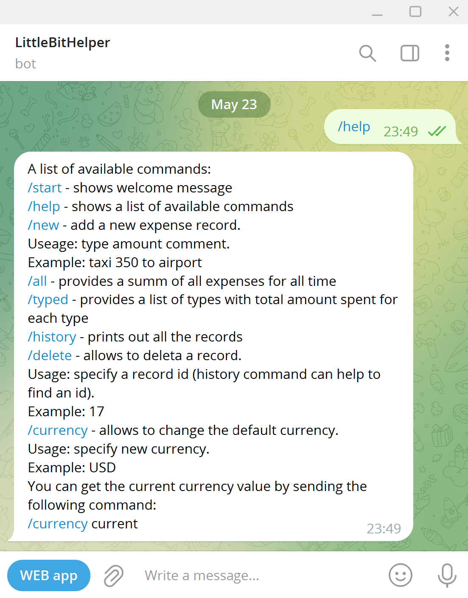
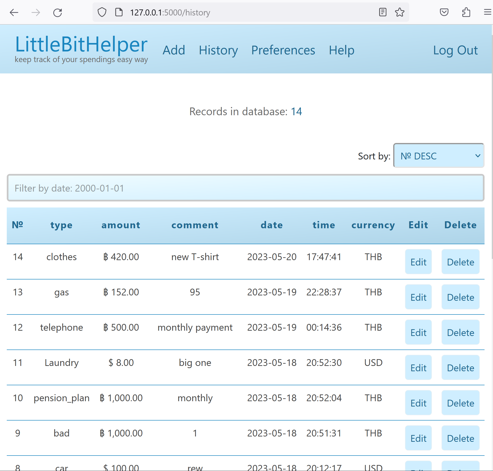

# "LittleBitHelper". A web app for expense tracking with Telegram bot integration
A Web app to track your expenses the easy way. Use web interface or telegram bot. The app is Written in C# and .NET.

## **Description**:

The LittleBitHelper Web App designed to make your expense tracking easy. You can add your spendings records to the app via web interface as well as via Telegram bot. Then you can get the overall amount spent, total amount by category, records filtered by date and more.

Telegram bot is the on-the-go tool to add and read your records while web interface is more informative and loaded tool with enhanced functionality.

Telegram bot and web app work together. However, once a user account is created they can be used separately with no limitations. To get the greatest user experience it is recommended to combine usage of both tools.

If you have any questions or suggestions don't hesitate to reach me out via [GitHub](https://github.com/ivang5711)
or [Telegram](https://t.me/Girsov) or [email](girsovivan@outlook.com)

### **User interface screenshots**

  
<i>show/hide</i>

  

### How to run
#### Prerequisites
- .NET 7.0 runtime installed
- set up environment variables* ("name" : "variable"):
  - LBHB1 : "your Telegram bot API access token". You can get one via BotFather bot in Telegram. Refer to Telegram website to get more info about Telegram bots.
  - exchangeRatesProviderPath : "url of your exchange rates Provider. By design the app uses OpenExchangeRates.com and parses the data according to this service data structure."
  - exchangeAppId : "Your exchange provider access token"

  ###### * refer to your shell documentation to set up the environment variables

#### Run
1. To run the app you need to make sure you have .net7 runtime installed on your machine.
2. In a terminal window navigate to the project folder
3. Enter dotnet run to run the app

# **Technical details**

### **Implementation details**

The web app is written in C# using ASP.NET Razor Pages. Also the project contains  Javascript,
SQL, HTML and CSS code, and uses Bootstrap for the navigation bar, and AJAX chart script via CDN.
Exchange rates obtained via Openexchangerates web API.
Telegram integration via Telegram.Bot library utilizing Telegram bot API.

The apps can work independantly as long as they share the same database.

#### **database**
All the user expenses data collected in a single database tracker-database.db.
The database consists of two tables:
users and expenses
Users table contains user telegram ID and uses it as login, user's password hash and
default currency. Default value for the currency is USD.
Expenses table collects all the user's records and consists of user's telegram id,
autoincremented id, type, amount, comment, date, time, currency.
User identity data for authentication and authorization is stored in identitybase.db
Due to the lack of migrations feature support in SQlite + Entity Framework configuration the databases must be created manually and placed in the web app root folder.
The empty templates for the databases provided along with the source code. 

#### **data.json**
data.json file contains a dump of the exchange rate data for a given day. The data obtained from the Openexchangerates.org website via their web API. The service provides an option to download a certain rate or the whole list of rates for a given date. The request amount is limited for the free accounts. Because of that it was decided to download all the rates and store them locally in the data.json file to get access to them with no additional "fee" or waste of request count.

#### **Telegram Bot Client**
Once a user start the Telegram bot or sends a message the bot checks if the user is registered. No password required since the app checks the user's Telegram ID which it obtains via each user's message automatically.

If the user is not registered the only command available is /start. This command returns to the user the user's Telegram ID and a welcome message.

Once the user registers via Web App the /start command changes the response and shows the list of helpful commands.

When user sends a command the bot.py process it with a corresponding handler.
All the handlers have filters to "recognize" a certain command.
Once the command recognized the code inside the handler is executed.

As an illustration let's take a look at the /new command.

The command must be executed with 2 mandatory and 1 optional parameters.
A user must provise a single word representing the type of expense. after the first word the amount spent and after that any number of any symbols as a comment.

The /new handler parses the string provided by user and creates 3 variables to store the corresponding data. If it fails to parse that quite likely means the input is incorrect and the handler returns a mesage to the user with the brief guide of how to provide data to the command. If the command executed successfully the corresponding message sends to the user.

### **Dependencies**

To run the apps the dotnet 7.0 runtime is required.

List of dependencies:

- Dapper
- System.Data.SQLite
- Telegram.Bot
- Microsoft.EntityFrameworkCore.Tools
- Microsoft.EntityFrameworkCore.Sqlite
- Microsoft.AspNetCore.Identity.UI
- Microsoft.AspNetCore.Identity.EntityFrameworkCore
- Microsoft.AspNetCore.Diagnostics.EntityFrameworkCore

# **Interface and features overview**

In order to use the app you need to register first.
## **Register a new user**

To register a new user follow these steps:
### **step 1**

To create a new account you need to provide an email assress. It will be used as a login. Then create a strong password and fill in confirmation box. Then press register.
### **step 2**

After registration is complete you will be redirected to the login page. Fill in the login boxes with your email and password correspondingly and press login. If the login is successful you will see the main page with your records summary.

### **step 3**
Go to the account settings page and fill it your Telegram ID in the Telegram ID field. 
To get your Telegram ID you can simply start a conversation with the LittleBitHelperBot.
If you are not registered yet the bot will provide your Telegram ID in the very first message.

## **Web interface**

Let's make a quick overview of the web interface.
### **Home page**

The first page is the summary page. It provides a table and a chart representing your expenses grouped by type. More on this later in this section. If you do not have records yet there would not be anything to show. All the info appears as you add your first record. Why don't we add one? To do this we should go to the Add page.
### **Add page**

On the Add page you can use the boxes and a drop down menu to add a new record. There are a couple of rules to follow.

The "type" field allows a single word only. The word can contain any symbol except spaces. This field intended to categorize your expenses by the type provided. There is no limit on the type amount. However, it is recommended to stick to the reasonably limited amount of types for the sake of the presentability of the statistics results and overall visual convenience.

The "amount" field can contain only numbers. Here you must provide a number greater than 0.

The "comment" field is optional. Us it as you think best. A suggestion here is to use it to add some specific to the record. This can help to use search in future when the amount of records becomes high.

Also there is a drop down list where you can pick a currency of the record. If you leave this field default then the current default currency will be applied. For all the new users the default currency is preset to USD. You can change your default currency to any currency on the Preferences page.
### **History page**

On the History page you can see a list of all your records. By default it sorted from the most recent to the oldest ones. You can choose other sorting type in the drop down menu on the top right corner of the table.

Next to each record there are two buttons: a Delete button and an Edit button.

The Delete button does exactly what it meant to do - deletes a record.

The Edit button provides an interface to edit a particular record. You can change any parameter except the date and time. These remain the same for security reasons. Remember the type and amount fields are mandatory. After edit is complete click on the Submit button and you will be redirected back to the History page.
### **Preferences page**

On the Preferences page you can change you default currency. Pick one from the drop down list and click Submit. The currency symbol and USD to the selected currency rate will appear on the page. The currency rates updates once a day and provided by Openexchangerates.
### **Help page**

Finally here you can find some info about the web app and some guides to start using it. If you have any questions or want to provide some feedback - you can do it via GitHub
## **Telegram bot**

The Telegram bot is an accessible tool to track expenses on the go as easy as possible without using additional app. Telegram can be installed on any platform either desktop or mobile and the user experience is quite natural for telegram (or any other messenger) users. It is just as simple as a regular chat in a messenger!
### **Getting started**

You have to be registered in the web interface first in order to use LittleBitHelperBot. See register section of this page to create an account. Once registered you can start using LittleBitHelperBot with no limitations.

Now send "/start" command to the bot. It will send a greeting back to you. Send "/help" command to see the list of available commands with description and usage examples. See Available commands section to learn more about all the available commands.
### **Available commands**

#### /start

Shows welcome message

#### /help

Shows a list of available commands

#### /new

Adds a new expense record. Usage: type amount comment. Example:/new taxi 350 to airport
The same rules as for the web interface apply to the telegram bot. Therefore the type field must contain of a single word. Any symbol is allowed for the type field except the "space" symbol.
value field is mandatory too. It must contain digits only and must be grater than 0.
The comment field is optional and can contain any amount of any symbols including the "space" symbol. That means it can consists of multiple words.
The input scheme should look like this:

| /new | type | amount | comment |
|------|------|--------|---------|
| /new | food | 20     | my 1'st tasty burger... mmm

The example above is a valid input for the /new command. With the correct words provided separated by spaces the record will be submitted with no errors.

#### /all

Provides a sum of all expenses for all time.

#### /typed

Provides a list of types with total amount spent for each type.

#### /history

Prints out all the records.

#### /delete

To delete a record you must provide an ID of the record. To get the ID you can send the /history command first, find the record of your choice, and pass it's id to the delete command.
For example: /delete 78.

#### /currency

Use this command to see and update the current default currency. To see the current value sent /currency current command.
To change the current default currency to USD send /currency USD.
To change to Euro send /currency EUR. If the currency sent is invalid a message will inform you.

If you have any questions or suggestions don't hesitate to reach me out via [GitHub](https://github.com/ivang5711)
or [Telegram](https://t.me/Girsov) or [email](girsovivan@outlook.com)

API provided by https://openexchangerates.org